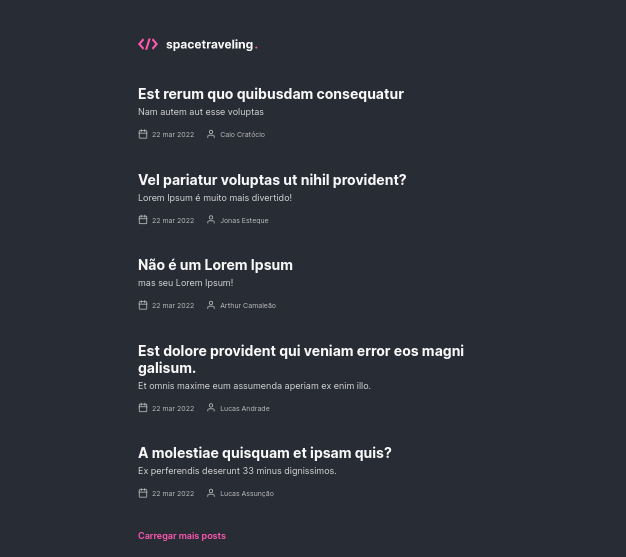

## Ignite Blog  

---
### About it :bookmark_tabs:

This project is Blog Website built with ReactJS,NextJS, Prismic CMS, SASS and CSS Modules. It is possible to read a Post (all posts are created in Prismic), comment in a post and preview a post in Prismic (it requires an authentication). 

### Installation :floppy_disk:

This project requires yarn (or npm) and nodeJS.

Install the dependencies and devDependencies and start and the application with yarn dev.

```sh
yarn install
yarn dev
```

⚠️ Warning: You will need to conect this project with your own Prismic Project and use <strong>.env</strong> variables to run properly.

### Screens
Homepage: 


### Author :rocket:

Give it a :star: if you enjoyed the project !

**Free Software!!**
